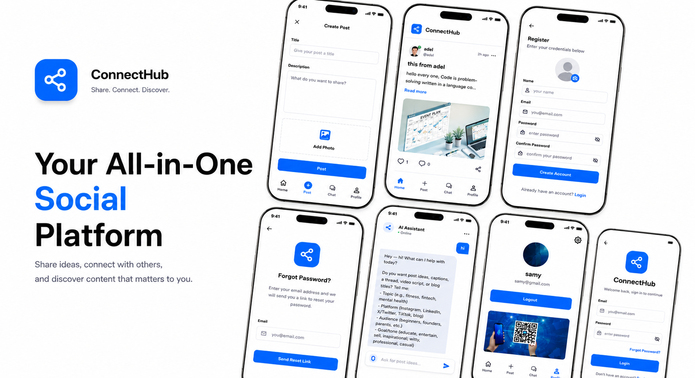

# ConnectHub



ConnectHub is a Flutter social networking app with a Firebase backend. It covers the
core loop of a social feed — authentication, posting, commenting, liking, profiles —
plus a built-in AI chat .

## Features

- **Authentication** — email/password sign up, login, and forgot-password flows, backed
  by Firebase Auth.
- **Feed** — home feed of posts with pagination, likes, and a dedicated comments screen.
- **Posts** — create posts with text and images (picked and cropped from the device).
- **Profile** — view and manage the current user's profile and their posts.
- **AI Chat** — a chatbot view (user/bot message roles) that talks to an external
  n8n webhook and persists conversation history to Firestore.
- **Splash screen** with animated intro before routing into the app.

## Tech Stack

- **Framework**: [Flutter](https://flutter.dev) (Dart SDK `^3.10.4`)
- **State management**: `bloc` / `flutter_bloc` with `equatable`
- **Dependency injection**: `get_it`
- **Routing**: `go_router`
- **Backend**: Firebase — `firebase_core`, `firebase_auth`, `cloud_firestore`, `firebase_storage`
- **Networking**: `dio`, `pretty_dio_logger`, `internet_connection_checker_plus`
- **Images**: `image_picker`, `image_cropper`, `cached_network_image`, `flutter_svg`
- **UI/UX**: `flutter_screenutil` (responsive design), `google_fonts`, `skeletonizer`
  (loading skeletons), `dotted_border`, `persistent_bottom_nav_bar`, `flutter_native_splash`
- **Utilities**: `intl`, `dartz`, `permission_handler`, `mime`, `shared_preferences`,
  `flutter_dotenv`

## Architecture

The project follows a **feature-first, clean-architecture-inspired** structure. Each
feature is split into a `data` layer (models, repositories) and a `presentation` layer
(cubits, views, widgets), with shared code centralized under `core`.

```
lib/
├── core/
│   ├── constant/       # App-wide constants (collection names, limits, design sizes)
│   ├── di/             # get_it service locator setup
│   ├── extensions/     # Dart/Flutter extensions
│   ├── network/        # Dio setup, API result wrapper, error handling
│   ├── routing/        # go_router configuration and route names
│   ├── services/       # Firebase auth/firestore/image services
│   ├── theme/          # Colors, text styles, light theme
│   ├── utils/          # Validators, asset paths, helpers
│   └── widgets/        # Shared/reusable widgets (buttons, text fields, nav scaffold, ...)
├── features/
│   ├── auth/           # Login, register, forgot password
│   ├── chat/           # AI chatbot (n8n webhook + Firestore history)
│   ├── feed/           # Home feed + comments
│   ├── post/           # Create post
│   ├── profile/        # User profile
│   └── splash/         # Splash screen
├── firebase_options.dart
└── main.dart
```

## Getting Started

### Prerequisites

- [Flutter SDK](https://docs.flutter.dev/get-started/install) (compatible with Dart `^3.10.4`)
- A [Firebase](https://firebase.google.com/) project with **Authentication**, **Firestore**,
  and **Storage** enabled
- Android Studio / Xcode for platform builds, or a configured device/emulator

### Clone the repository

```bash
git clone https://github.com/ME-ElSayed/ConnectHub.git
cd ConnectHub
```
